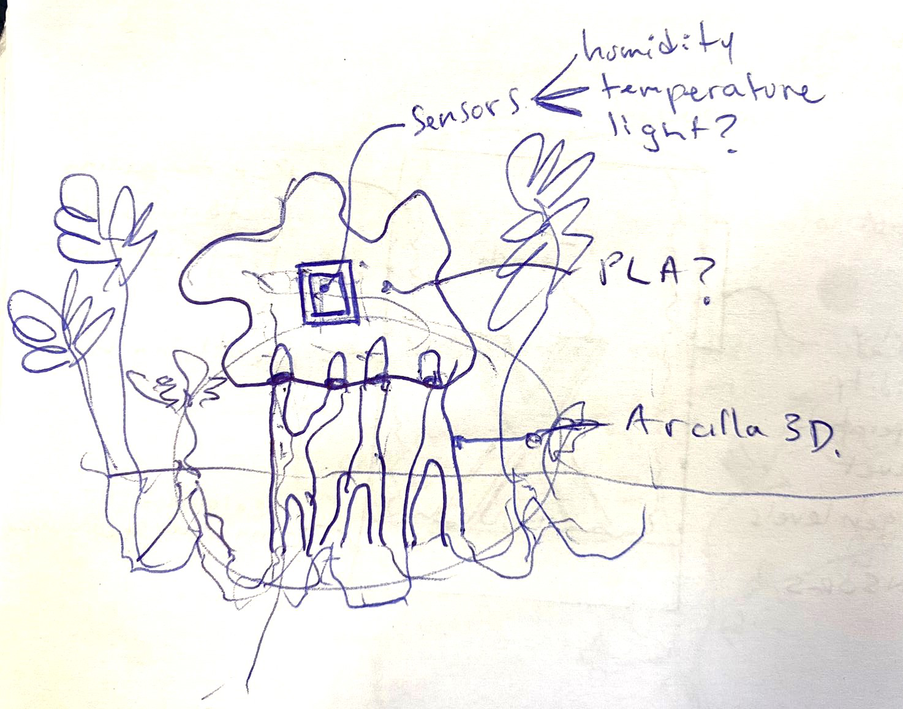
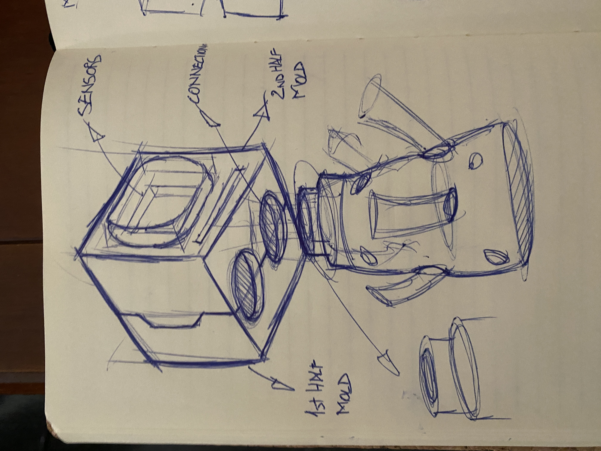
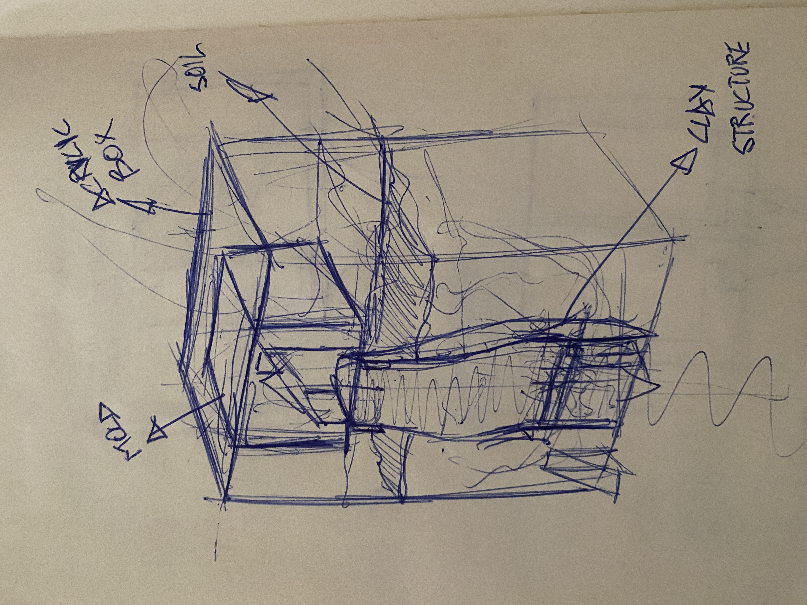
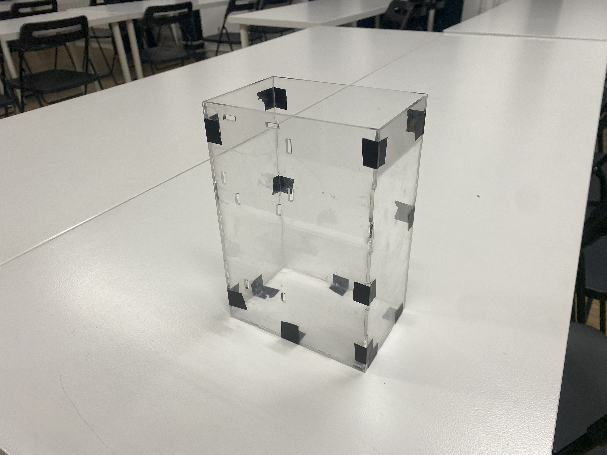
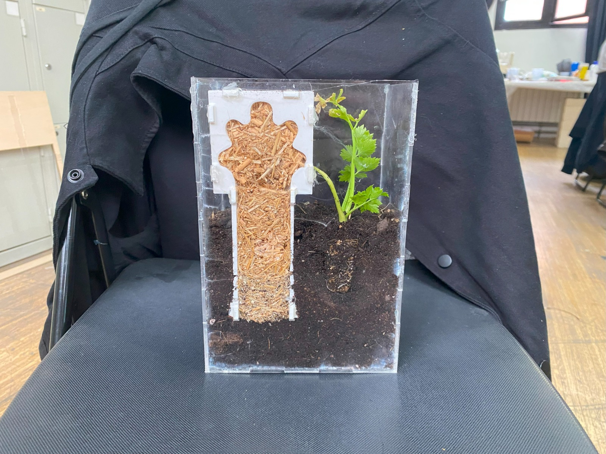

# Myco-farm
## Microchallenge I
**Project by:
[Everardo Castro Torres](https://everardocastro.github.io/mdef1/)
[Jorge Muñoz Zanón](https://jmuozan.github.io/mdef-website/)**

The following project tries to put to the test a new way of manufacturing. Based on the growth of mycelium, this project offers a different approach to grow mycelium than doing it in a Lab.

By planting molds to the soil connected via 3d printed clay structures that allow mycelium to both, grow through the mold and expand its net to eventually connect to the mycorrhizae. This method, allows exchange of nutrients between the mold and the natural ecosystem. Through this artifact we explore the idea of taking resources in a more responsible way, exchanging nutrients and the new mycorrhizae network for a desired object, fruit, etc...
Further research is needed in order to not alter the ecosystem's balance (fungi species, plant species).

The myco-farm takes the main idea and converts it into an ant farm allowing us to be observers in the evolution of growth of the mycelium. The myco-farm, consists of an acrylic box with the 3d printed connections and mold sectioned and fixed to the acrylic wall so we can see the whole process of growth.

## References 

Looking out for references, we've seen that other people have managed to properly grow mycelium outdoors (As it's natural) but not in complex molded shapes. For that reason we also wanted to see how will the mycelium adapt to more complex shapes. Also, non of the examples we saw had the philosophy we had behind them of not taking without leaving.

https://aleawork.com/back-to-dirt-mycelium

https://www.boisbuchet.org/workshop/mycelium-nothing-really-matters/#

## Integrated Design

To test the initial hypotesis we decided to make a small sample that we could observe and analyze the growth and connections of the mycelium without taking a lot of time. To do it we decided, similarly to an ant farm to make a section of the mold and connection and the ground. The artifact consists of a surrounding made out of an acrylic box, half mold and half the connection piece connected between each other and to the acrylic wall. The box will be filled with the mycelium and soil so we will be able to properly observe the evolution of the growth. Also, the box will have lateral space to add sensors or other living beens so we could also see how the mycorrhizae interacts with them.

## System Diagram

As it was explained before this is the way the concept design was imagined before fabrication:

- **(1, 2, 3, 4) Box:** Acrylic box that will make "imaginary" surroundings for us to see through them.

- **(5) Connection module:** This piece, as it's name says will be the ***connection*** between the mold and the soil. It's a semi circular tube able to fit the top part on the mold and full of holes on the side so the mycelium network will be able to expand.

- **(6) Mold:** The last piece it's the mold itself, it's cut by half and it has to be connected to the face of the box, on the bottom it has a semicircular hole where piece 2 will be connected. Also, has different breathing 

## Piece Definition and Fabrication Process

- **Box:** For the fabrication of the box, we designed the 2D shapes of the different faces on Rhinoceros, applying the different finger edge joints on the sides and creating new squared connections on the front face to join the box with both the tubular connection and with the mold.After this, we assigned different colors following the hierarchy of the laser cut machine, red for the interior cuts and blue for the outside cuts.

  

- **Connection:** To manufacture this piece we tried two different fabrication techniques. First we tried with the hacked 3D paste printer because we wanted the final result to be printed in clay so the hole artifact will be and feel more natural but the machine gave us a lot of problems while printing. For that reason, as we didn't have a lot of time and the goal of the challenge was mainly to test the initial hypothesis, we ended up deciding to print it in PLA as the mold. 
As it was mentioned before, the piece contains different squared extrusions on the front face so it can fit with the holes made in the box front face, Also, on the bak part we added different hoes so the mycorrhizae can expand it's network through the soil.

- **Mold:** To make the half/mold we decided to print it with PLA too. The semi circular hole on the bottom part is made so the roots of the mycorrhizae can travel trough and fill both the mold and the connection piece. On the back part, we added some holes so the mycelium inside will be able to breath. In the folder, make a mold, you will be able to create your desired shape inside the mold as we facilitated open 3D NURBS based file formats (.igs and .step) with the mold shape filled. By making a simple ***boolean difference*** operation in your desired 3D software you can print the desired shape inside the mold to fiti it in the ***myco-farm***

## Mycelium

Once the artifact was done we had to fill it with mycelium. Here you can see a step by step tutorial on how we do it.

1. Prepare the substrate. In this case, small amount of coffee was added for additional nutrients.

2. Place the substrate in a heat resistent bag to sterilize it in the pressure cook.

3. Put the pressure cook in Meat mode (fablab biolab) for 45 min.

4. Sterilize EVERYTHING else with alcohol and use gloves.

5. Put on a flame to create a sterilizing bubble where you can work in.

6. Place a layer of dirt to support the conection piece.

7. Take the subsrate out of the pressure cook and add sculpting nutritional mix.

8. Add straw innoculated with mycelium and mix.

9. Add the mix into the connection and mold.

10. Fill with dirt and place a little plant, in this case it was a celery <3.

## Data Capture Implementation

To properly observe and analyze, we decided to add some sensors to the box, measuring temperature, humidity... As we were suggested to use the ***Parrot Flower-Power*** sensor, an all in one sensor capable of measuring temperature, light, fertilizers and watering. As it was an all in one sensor with a dedicated phone app, we thought it will be easier than assembling and coding all by ourselves. Problem came when we realized the sensor is no longer supported by Parrot so we had to ***hack*** it and extract the data with a computer and save it in a .csv file for proper analysis later. This was a hard process where we needed a lot of help from Mikel to read data from the sensor with a Raspberry. As we didn't had enough time and we lack some technical skills we didn't finish this part yet. For future iterations will be ideal to manage to take that data and put it in a csv file for visualization.

## Final Result and Reflections

Once the artifact with the mycelium was fully done, we decided to add a plant into it to see how would the mycorrizhae interact with it. Even though we couldn't see immediate results, we were happy with the result, as it was a super interesting concept to experiment on. With more time and knowledge, a few things could have been done better such as having build the connection on clay, use a different material (more friendly with the mycelium) for the 3d printed mold and manage to add the parrot sensor. Over all it was a super interesting speculative project that we had fun iterating over.

***Update 21/03/24:** We've seen that the growth of the mycelium hasn't been the optimum when placing the box outdoors. It's possible that the February weather has been too cold for the mycelium to grow. We will keep observing.

